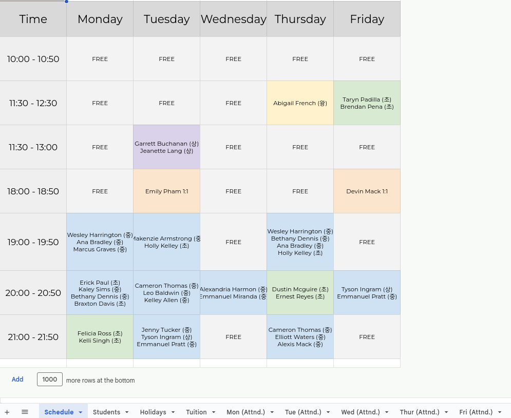
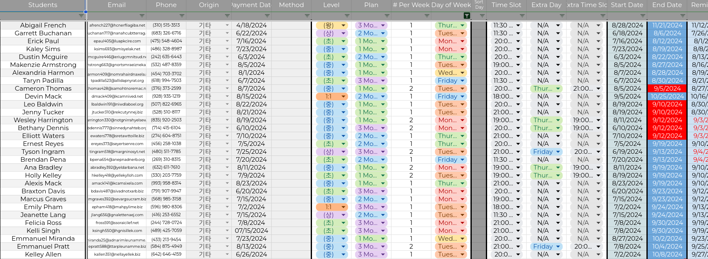

# Academy Admin Scheduler

The Academy Admin Scheduler is a comprehensive scheduling and management tool designed specifically for academy or hagwon owners. A friend of mine grew their private tutoring business into a group-class style English academy for adults, so I made this for them. This Google Sheets-based system handles class scheduling, tuition calculations, attendance tracking, and payment management for educational businesses, offering administrators an all-in-one solution to streamline operations.

## Features
<table>
  <tr>
    <td align="center">
      
       
      <em>PNG 1</em>
    </td>
    <td align="center">
      
       
      <em>PNG 2</em>
    </td>
  </tr>
</table>

* Class Scheduler: Automatically generates a weekly class schedule, with student groups color-coded based on their skill level
* Tuition Calculator: Calculates tuition fees for students based on scheduled classes, accounting for public holidays and pre-scheduled days off
* Attendance Roster Generator: Automatically creates daily attendance rosters for each class, making it easy to track student participation
* Payment Scheduler: Alerts academy owners to upcoming payments and overdue fees
* Holiday Management: Automatically excludes public holidays and scheduled days off from class days, ensuring students are not billed for days when no classes are held

## Setup

**1. Download the file**
* Clone or download the Excel file (academy-admin-scheduler.xlsx) from this repository or from this [link](https://docs.google.com/spreadsheets/d/1ZTpfdRSxcI8C-x1T0WUDKbrg1Y-GgwgnqSH-qNFdVz8/edit?usp=sharing).

**3. Open in Google Sheets or Excel**
* Use Google Sheets or Microsoft Excel to open the file.

**4. Add your data**
* Input your students, teachers, holidays, tuition rates, and class information in the corresponding sheets.

**5. View the schedule**
* The scheduler will automatically generate a viewable schedule, tuition breakdown, and payment schedule.

## Author

[booknite]

## License

This project is licensed under the MIT License.

